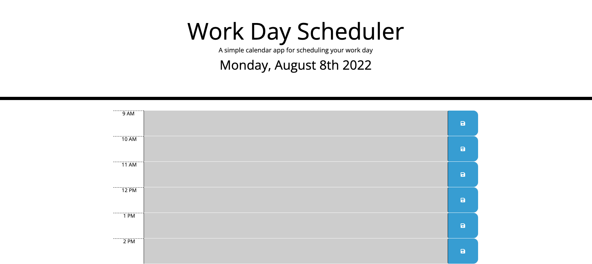

# Work-Day-Scheduler

## Description

This project is a work day scheduler. It lists the hours of your work day and allows you to add objects that need to be completed. As the day goes by, the current time updates the color of the sections and lets you know where you are throughout the current day. After typing in an objective you are able to hit the save button and whatever info you enetered will get stored in local storage.

## Usage

https://3enhobson.github.io/Work-Day-Scheduler/

